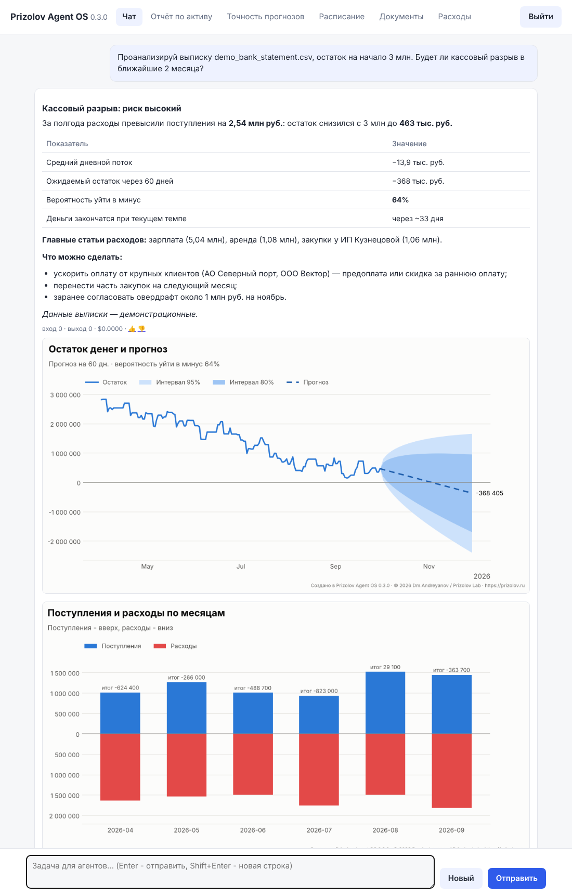

<!-- Prizolov Agent OS 0.3.0 | Author: Dm.Andreyanov | Brand: Prizolov Lab | © 2026
SPDX-FileCopyrightText: 2026 Dm.Andreyanov / Prizolov Lab
SPDX-License-Identifier: Apache-2.0 -->

# Prizolov Agent OS

**Author:** Dm.Andreyanov · **Brand:** Prizolov Lab · © 2026 · version 0.3.0 · [prizolov.ru](https://prizolov.ru) · [Русский](README.md)

[](https://github.com/GIBDD-DPS/prizolov-agent-os/actions/workflows/ci.yml)
[](LICENSE)
[](https://www.python.org/downloads/)

A team of AI agents built on Claude (Anthropic) for business. A Director agent
splits the task between specialists, checks the result and learns from mistakes.
On top of that you get:

- forecasts for metals, stocks, currencies and crypto that learn from their own
  errors;
- cash-flow analysis;
- a local knowledge base over your documents;
- a web interface, a Telegram bot, scheduled tasks and an HTTP API.

The interface and agent replies are in Russian by default. The agents answer in the
user's language.



## Try it in a minute

No Claude key needed (the bank statement is demo data from [examples/](examples/)):

```bash
git clone https://github.com/GIBDD-DPS/prizolov-agent-os.git && cd prizolov-agent-os
pip install -e .
prizolov cashflow examples/demo_bank_statement.csv --balance 3000000 --days 60
prizolov report GC=F --horizons 1,7,15,30      # gold futures, Yahoo Finance
```

Then run:

- `prizolov init` — set up the Claude key, Telegram and the web interface;
- `prizolov doctor` — check that everything works.

## Features

- **Agent team.** The Director delegates to specialists; independent subtasks run in
  parallel.

  | Specialist | Role |
  |---|---|
  | assistant | calculations, dates, files |
  | researcher | web and document search with sources |
  | writer | articles, reports, letters |
  | cash-flow analyst | bank statements, cash gaps |
  | market analyst | prices and forecasts |
- **Market forecasts.**
  - Data sources: Yahoo Finance, Moscow Exchange, Bank of Russia.
  - Every forecast has a median, 80% and 95% intervals and the probability of growth.
  - It also says how many backtested forecasts the method was checked on and how
    often the outcome fell inside the interval.
- **Learning from errors.**
  - Four forecasting methods compete on each asset's history.
  - Forecasts that come due are checked against actual prices, and interval
    calibration adapts within bounds.
  - User ratings and critic reviews become lessons for the agents.
  - Improved prompts and agent-written tools are enabled only after your approval.
- **Self-check.** A critic reviews complex answers; the agent revises low-scoring ones.
- **Knowledge base.** PDF, Word, Excel, CSV, TXT and MD files are indexed locally with
  SQLite FTS5.
- **Safety.**
  - Agents can access files only in the workspace folder, and writing requires
    confirmation.
  - Content from web pages and documents is treated as data, which protects against
    prompt injection.
  - Agent-written tools run in a separate sandboxed process.
- **Cost control.** Cost per task, task and daily limits, a step-by-step trace log,
  compaction of long conversations.
- **Interfaces.** Web UI, terminal, Telegram bot, HTTP API, scheduler, Docker.

## Install

Python 3.10+:

```bash
pip install -e .              # core: agents, forecasts, reports, CLI
pip install -e ".[api]"       # + web interface and HTTP API
pip install -e ".[telegram]"  # + Telegram bot
prizolov init                 # writes .env step by step
prizolov doctor               # checks the key, data sources, folders
```

## Usage

```bash
prizolov chat                                       # interactive chat with the agents
prizolov run "Forecast the USD/RUB rate for 30 days"
prizolov report GOLD --horizons 1,7,15,30           # forecasts without Claude
prizolov cashflow bank.csv --balance 500000         # cash-flow analysis without Claude
prizolov api                                        # web UI at http://127.0.0.1:8800
prizolov telegram                                   # Telegram bot (whitelist only)
docker compose up -d                                # web UI and API in Docker
```

Scheduled tasks are set up with `/schedule` in the chat or Telegram, or by asking:
"send me a gold report every weekday at 9:00".

## Documentation (Russian)

- [docs/architecture.md](docs/architecture.md) — how the system works.
- [docs/configuration.md](docs/configuration.md) — all settings.
- [docs/api.md](docs/api.md) — HTTP API reference.
- [examples/](examples/) — demo data and walkthroughs.
- [CONTRIBUTING.md](CONTRIBUTING.md), [SECURITY.md](SECURITY.md), [CHANGELOG.md](CHANGELOG.md).

## Authorship and license

Copyright © 2026 **Dm.Andreyanov / Prizolov Lab**. Licensed under [Apache 2.0](LICENSE).
Any redistribution of this program or a derivative work must keep the attribution
notices in [NOTICE](NOTICE) and the file headers, and modified files must be marked
as changed. Citation: [CITATION.cff](CITATION.cff).
