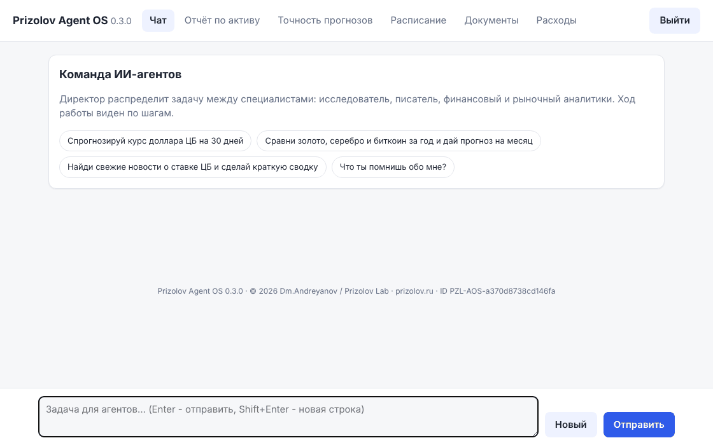
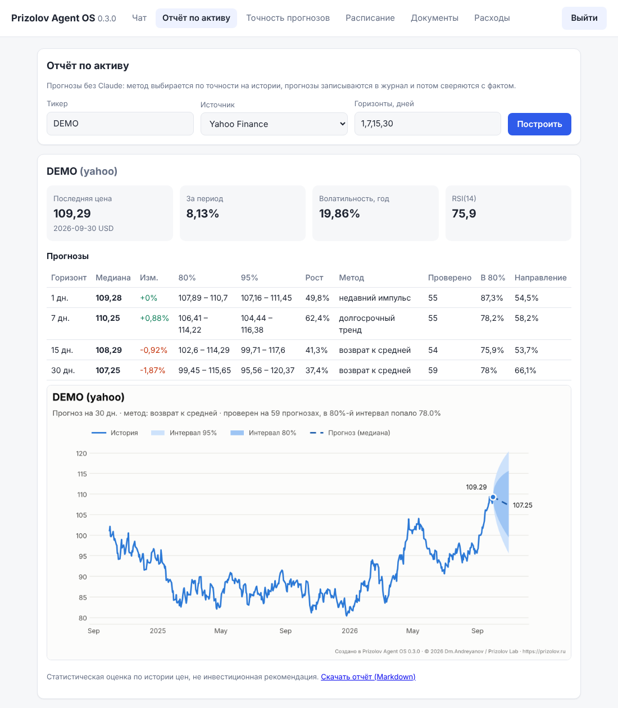

<!-- Prizolov Agent OS 0.3.0 | Author: Dm.Andreyanov | Brand: Prizolov Lab | © 2026
SPDX-FileCopyrightText: 2026 Dm.Andreyanov / Prizolov Lab
SPDX-License-Identifier: Apache-2.0 -->

# Prizolov Agent OS

**Автор:** Dm.Andreyanov · **Бренд:** Prizolov Lab · © 2026 · версия 0.3.0 · [prizolov.ru](https://prizolov.ru) · [English](README.en.md)

[](https://github.com/GIBDD-DPS/prizolov-agent-os/actions/workflows/ci.yml)
[](LICENSE)
[](https://www.python.org/downloads/)

Команда ИИ-агентов на моделях Claude (Anthropic) для бизнеса: Директор распределяет
задачу между специалистами, проверяет результат и учится на ошибках. Есть прогнозы
металлов, акций, валют и криптовалют, анализ движения денег, база знаний по вашим
документам, веб-интерфейс, Telegram-бот, расписание и HTTP API.



## Попробовать за минуту

**В браузере, без установки:** нажмите
[](https://codespaces.new/GIBDD-DPS/prizolov-agent-os?quickstart=1)
— через пару минут откроется готовая среда с подсказками; веб-интерфейс запускается
командой `prizolov api`.

**На своём компьютере** — без ключа Claude и без регистрации (выписка — демо-данные из [examples/](examples/)):

```bash
git clone https://github.com/GIBDD-DPS/prizolov-agent-os.git && cd prizolov-agent-os
pip install -e .
prizolov cashflow examples/demo_bank_statement.csv --balance 3000000 --days 60
prizolov report GOLD --horizons 1,7,15,30      # реальное золото, данные ЦБ РФ
```

Дальше — `prizolov init` (ключ Claude, Telegram, веб-интерфейс за минуту) и
`prizolov doctor` (проверка, что всё работает).

## Содержание

- [Что умеет](#что-умеет)
- [Установка](#установка)
- [Быстрый старт](#быстрый-старт)
- [Веб-интерфейс](#веб-интерфейс)
- [Docker](#docker)
- [Платёжный календарь и выписки 1С](#платёжный-календарь-и-выписки-1с)
- [Портфель инвестора](#портфель-инвестора)
- [Госзакупки](#госзакупки)
- [Договоры](#договоры)
- [Отчёт по активу без Claude](#отчёт-по-активу-без-claude)
- [Открытая статистика точности](#открытая-статистика-точности)
- [MCP: Claude Desktop, Cursor](#mcp-claude-desktop-cursor)
- [Telegram-бот](#telegram-бот)
- [Расписание](#расписание)
- [HTTP API](#http-api)
- [Использование из Python](#использование-из-python)
- [Документация](#документация)
- [Разработка](#разработка)
- [Авторство и лицензия](#авторство-и-лицензия)

## Что умеет

- **Команда агентов.** Директор понимает задачу и поручает её специалистам:
  - ассистент — расчёты, даты, файлы;
  - исследователь — поиск в интернете и в ваших документах, с источниками;
  - писатель — статьи, отчёты, письма;
  - финансовый аналитик — выписки, статьи расходов, платёжный календарь;
  - рыночный аналитик — цены, прогнозы и портфель инвестора;
  - юрист по договорам — риски в договорах, сравнение версий;
  - специалист по госзакупкам — поиск закупок 44-ФЗ/223-ФЗ и разбор документации.

  Независимые поручения выполняются одновременно.
- **Прогнозы рынков.** Источники данных: Yahoo Finance (мировые акции, валюты,
  криптовалюты, фьючерсы на металлы), Мосбиржа и ЦБ РФ (курсы рубля, учётные цены
  золота, серебра, платины, палладия).
  - Каждый прогноз содержит медиану, интервалы 80% и 95% и вероятность роста.
  - К каждому прогнозу приложено, на скольких прогнозах проверен метод и как часто
    он попадал в интервал.
- **Платёжный календарь.** Выписки из любого клиент-банка в формате 1С, CSV или Excel;
  статьи расходов; плановые платежи; день кассового разрыва, сумма нехватки и какие
  платежи можно перенести.
- **Портфель инвестора.** Из файла или брокерского счёта T-Invest: доли, риск (VaR,
  просадка), стресс-тесты, концентрация, прогноз по каждой бумаге.
- **Госзакупки.** Поиск открытых закупок в ЕИС с ежедневной подборкой новых, разбор
  документации и проекта контракта: участвовать или нет.
- **Договоры.** Проверка рисков с цитатами и правками, сравнение версий договора.
- **Открытая статистика точности.** Страница, где видно, сколько прогнозов сбылось на
  самом деле.
- **MCP-сервер.** Все эти инструменты — в Claude Desktop, Cursor и других MCP-клиентах.
- **Самообучение на ошибках.** Методы прогноза соревнуются на истории. Наступившие
  прогнозы сверяются с фактом, и калибровка интервалов подстраивается в заданных
  границах. Из ваших оценок (`/good`, `/bad`) и замечаний критика получаются уроки
  агентам. Улучшенные промпты и новые инструменты агентов подключаются только после
  вашего одобрения.
- **Самопроверка.** Сложные ответы проверяет критик; при низкой оценке агент
  дорабатывает ответ.
- **База знаний.** PDF, Word, Excel, CSV, TXT и MD из рабочей папки индексируются
  локально (SQLite FTS5); агенты ищут в них по словам с учётом окончаний.
- **Отчёты и графики.** PNG-графики прогнозов и движения денег. Отчёты в Markdown
  подписываются автором.
- **Безопасность.**
  - Файлы читаются и пишутся только в рабочей папке; запись — с вашего подтверждения.
  - Работает защита от инструкций, спрятанных в веб-страницах и документах
    (prompt injection).
  - Инструменты, созданные агентами, запускаются в отдельном процессе после проверки
    кода.
- **Контроль расходов.** Стоимость каждой задачи. Лимиты на задачу и на день.
  Журнал трассировки всех шагов. Сжатие длинных диалогов.
- **Интерфейсы.** Веб-интерфейс, терминал, Telegram-бот, HTTP API, расписание задач,
  Docker.

## Установка

Нужен Python 3.10 или новее.

```bash
git clone https://github.com/GIBDD-DPS/prizolov-agent-os.git
cd prizolov-agent-os
pip install -e .                      # основа: агенты, прогнозы, отчёты, CLI
pip install -e ".[telegram]"          # + Telegram-бот
pip install -e ".[api]"               # + веб-интерфейс и HTTP API (FastAPI)
pip install -e ".[mcp]"               # + MCP-сервер для Claude Desktop и Cursor
pip install -e ".[all]"               # всё, включая инструменты разработки
```

Настройте ключ Anthropic ([console.anthropic.com](https://console.anthropic.com/)) и
остальное пошагово, затем проверьте установку:

```bash
prizolov init      # создаёт .env: ключ Claude, модель, лимит расходов, Telegram, ключ API
prizolov doctor    # проверяет ключ, источники котировок, папки, Telegram и API
```

Можно и вручную: `cp .env.example .env` и вписать `ANTHROPIC_API_KEY=sk-ant-...`.
Все настройки — в [docs/configuration.md](docs/configuration.md).

## Быстрый старт

```bash
prizolov chat                         # диалог с командой агентов
prizolov run "Спрогнозируй курс доллара ЦБ на 30 дней"
prizolov sessions                     # сохранённые диалоги
prizolov chat --session ID            # продолжить диалог
```

Примеры задач:

- «Сравни золото, серебро и биткоин за год и дай прогноз на месяц»
- «Проанализируй выписку inbox/bank.csv: будет ли кассовый разрыв в ближайшие 60 дней?»
- «Найди в договорах условия оплаты и сделай сводку в файл summary.md»
- «Запомни: наша валюта учёта — рубли, НДС 20%»

Ход работы виден по шагам: кто чем занят, какие инструменты вызваны, сколько
стоила задача. Команды чата — `/help`; основные:

| Команда | Что делает |
|---|---|
| `/good`, `/bad комментарий` | оценка ответа; замечание становится уроком |
| `/forecasts`, `/verify` | точность прогнозов и методов, сверка с фактом |
| `/schedule` | задачи по расписанию |
| `/cost`, `/budget` | расходы и лимиты |
| `/index` | обновить базу знаний |
| `/improve`, `/prompts`, `/approve-prompt N` | улучшение промптов по урокам |
| `/tools`, `/approve-tool имя` | инструменты, созданные агентами |

## Веб-интерфейс

```bash
pip install -e ".[api]"
prizolov init            # на шаге 5 создайте ключ доступа
prizolov api             # откройте http://127.0.0.1:8800 и войдите по ключу
```

Что есть в веб-интерфейсе:

- **Чат с агентами.** Ход работы виден по шагам, запись файлов подтверждается
  кнопкой, графики показываются прямо в ответе, ответы можно оценить 👍/👎 — оценки
  станут уроками.
- **Деньги** — загрузка выписки (1С, CSV, Excel), статьи расходов, плановые платежи и
  платёжный календарь с днём кассового разрыва.
- **Отчёт по активу.**
- **Точность прогнозов** — соревнование методов.
- **Расписание.**
- **Документы** — загрузка и поиск.
- **Расходы.**

Страница работает без внешних библиотек и CDN и защищена строгой политикой CSP.



## Docker

```bash
prizolov init                                # или cp .env.example .env и заполнить
docker compose up -d                         # веб-интерфейс и API: http://localhost:8800
docker compose --profile telegram up -d      # плюс Telegram-бот
```

Как устроен контейнер:

- запускается от непривилегированного пользователя;
- база, документы, отчёты и журналы хранятся в томе `prizolov-data`;
- расписание работает внутри контейнера; если запущены и API, и бот, задача всё равно
  выполняется один раз.

## Платёжный календарь и выписки 1С

Выгрузите выписку из клиент-банка в формате 1С (обычно кнопка «Экспорт в 1С»,
файл `kl_to_1c.txt`) — остаток на начало и направление платежей система возьмёт из
файла. Подойдут и CSV или Excel с колонками даты, суммы и назначения.

```bash
prizolov calendar add "Аренда офиса" -180000 2026-11-01 --repeat ежемесячно
prizolov calendar add "Заработная плата" -420000 05.11.2026 --repeat ежемесячно
prizolov calendar add "Оплата от АО Север" 900000 15.11.2026
prizolov cashflow kl_to_1c.txt --days 60
```

Команда покажет:

- поступления и расходы по месяцам и по статьям (зарплата, налоги, аренда,
  поставщики…);
- прогноз остатка с интервалами и вероятность уйти в минус;
- платёжный календарь по дням: в какой день случится кассовый разрыв, сколько не
  хватит и какие крупные платежи можно попробовать перенести.

То же — во вкладке «Деньги» веб-интерфейса и у агента: «Хватит ли денег до конца
месяца? Аренда 1-го, зарплата 5-го и 20-го». Демо: `examples/demo_bank_statement_1c.txt`.

## Портфель инвестора

```bash
prizolov portfolio мой_портфель.csv      # тикер;количество[;источник;цена покупки]
prizolov portfolio --tinvest             # счёт в Т-Инвестициях (токен только для чтения)
```

Покажет:

- стоимость в рублях, доли бумаг и классов активов;
- годовую волатильность, VaR 95% (возможная потеря за день и месяц), максимальную
  просадку;
- стресс-тесты: акции РФ −20%, рубль ±, крипта −40%, золото +15%;
- предупреждения о концентрации и прогноз по каждой бумаге.

Токен T-Invest — в `PRIZOLOV_TINVEST_TOKEN`. Это аналитика, а не инвестиционная
рекомендация. Демо: `examples/demo_portfolio.csv`.

## Госзакупки

```bash
prizolov tenders поставка офисной мебели --max-price 3000000
prizolov tenders ремонт кровли --new       # только ещё не показанные
```

Поиск открытых закупок 44-ФЗ и 223-ФЗ в ЕИС (zakupki.gov.ru). Агенту можно поручить:

- «каждое утро присылай новые тендеры на поставку мебели» — подборка по расписанию;
- «разбери документацию закупки» — требования, обеспечение, критерии оценки, порядок
  оплаты, штрафы и вывод, участвовать или нет.

Формат ленты ЕИС задаёт площадка; с площадкой может не быть связи из-за рубежа —
`prizolov doctor` покажет, доступна ли она.

## Договоры

Загрузите договор в рабочую папку и попросите: «Проверь договор поставки, мы
покупатель». Юрист по договорам:

- начнёт со сводки для руководителя — подписывать как есть, с правками или не
  подписывать;
- разберёт оплату, неустойки, ответственность, расторжение, автопролонгацию и
  подсудность;
- процитирует пункты и предложит формулировки правок.

Для двух версий — «Сравни v1 и v2 договора»: он покажет каждое изменение и кому оно
выгодно.

## Отчёт по активу без Claude

Прогнозы на несколько горизонтов, таблица и график. Ключ Anthropic не нужен, это бесплатно:

```bash
prizolov report GOLD --horizons 1,7,15,30     # золото, ЦБ РФ, руб./г
prizolov report GC=F                          # золото, фьючерс COMEX, $/унция
prizolov report USD                           # курс доллара ЦБ
prizolov report SBER --source moex            # акция Мосбиржи
prizolov report BTC-USD                       # биткоин
prizolov report --file prices.csv             # свой ряд цен (CSV или Excel)
```

Отчёт сохраняется в `workspace/reports/` (Markdown и PNG). Прогнозы записываются
в журнал и затем сверяются с фактом, так система учится. Это статистическая оценка
по истории цен, а не инвестиционная рекомендация.

## Открытая статистика точности

```bash
prizolov accuracy          # workspace/reports/accuracy.html - можно выложить на сайт
```

Страница строится только по прогнозам, срок которых наступил и которые сверены с
фактом. На ней видно:

- сколько прогнозов попало в интервал 80% (цель — около 80%);
- как часто угадано направление и средняя ошибка;
- разбивка по классам активов, горизонтам и активам.

С `PRIZOLOV_PUBLIC_ACCURACY=true` HTTP API отдаёт её всем по адресу `/public/accuracy`.

## MCP: Claude Desktop, Cursor

```bash
pip install -e ".[mcp]"
prizolov mcp               # MCP-сервер по stdio
```

Инструменты становятся доступны в Claude Desktop, Cursor и других программах с
поддержкой MCP:

- прогнозы;
- анализ выписок и платёжный календарь;
- портфель;
- госзакупки;
- сравнение и чтение документов, поиск по документам;
- статистика точности.

Ключ Claude серверу не нужен: модель — у клиента. Настройка — в [docs/mcp.md](docs/mcp.md).

## Telegram-бот

1. Создайте бота у [@BotFather](https://t.me/BotFather) и получите токен.
2. Узнайте свой Telegram ID у [@userinfobot](https://t.me/userinfobot).
3. В `.env`:

   ```
   TELEGRAM_BOT_TOKEN=123456:ABC...
   PRIZOLOV_TELEGRAM_ALLOWED_IDS=111111111
   ```
4. Запустите: `prizolov telegram`.

Особенности бота:

- Отвечает только пользователям из списка; без списка не запускается.
- Показывает ход работы и присылает графики.
- Перед записью файла спрашивает кнопками «Разрешить» и «Отклонить».
- Присланные документы сохраняет в базу знаний.
- В процессе бота работает и расписание.

## Расписание

```
/schedule report "по будням 9:00" GOLD 1,7,15,30
/schedule add "по понедельникам 10:00" Обзор рынка металлов за неделю
/schedule                          список
/schedule run|pause|resume|remove N
```

- **Формат времени:** «ежедневно 09:00», «по будням 9:30», «по понедельникам 10:00»,
  «каждые 6 часов» или строка cron.
- **Часовой пояс:** `PRIZOLOV_TIMEZONE`, по умолчанию Москва.
- **Без команд:** можно просто попросить: «присылай каждое утро обзор золота».
- **Сверка прогнозов:** встроена, ежедневно в 08:50.
- **Где выполняется:** в процессе Telegram-бота, в `prizolov api --scheduler` или в
  отдельном процессе `prizolov scheduler`. Можно запустить несколько: каждая задача
  выполнится один раз.

## HTTP API

```bash
# в .env: PRIZOLOV_API_KEYS=<ключ не короче 16 символов>
python -c "import secrets; print(secrets.token_urlsafe(32))"   # создать ключ
prizolov api                      # веб-интерфейс: http://127.0.0.1:8800, API: /docs
```

```bash
KEY=...
curl -X POST localhost:8800/v1/tasks -H "Authorization: Bearer $KEY" \
     -H "Content-Type: application/json" -d '{"message": "Курс юаня ЦБ на неделю"}'
curl localhost:8800/v1/tasks/<id> -H "Authorization: Bearer $KEY"

curl -X POST localhost:8800/v1/reports -H "X-API-Key: $KEY" \
     -H "Content-Type: application/json" -d '{"symbol": "GOLD", "horizons": [1, 7, 15, 30]}'
```

Все методы описаны в [docs/api.md](docs/api.md); готовый клиент на Python —
[examples/api_client.py](examples/api_client.py).

## Использование из Python

```python
from prizolov_os.core.kernel import Kernel

kernel = Kernel.create()                       # настройки из .env
result = kernel.chat("Спрогнозируй цену серебра на 2 недели")
print(result.text, result.usage.cost_usd)
kernel.feedback(positive=False, comment="Указывай источник данных")
```

Отчёт без модели:

```python
from prizolov_os.forecasting import ForecastEngine, ForecastJournal
from prizolov_os.market import MarketData
from prizolov_os.memory import Store
from prizolov_os.reports import market_report, to_markdown

engine = ForecastEngine(ForecastJournal(Store("data/prizolov.db")))
report = market_report(MarketData(), engine, "GOLD", horizons=(1, 7, 15, 30))
print(to_markdown(report))
```

## Документация

- [docs/architecture.md](docs/architecture.md) — как устроена система:
  - агенты;
  - самообучение;
  - прогнозы;
  - база знаний;
  - безопасность.
- [docs/configuration.md](docs/configuration.md) — все настройки `.env`.
- [docs/api.md](docs/api.md) — HTTP API.
- [docs/mcp.md](docs/mcp.md) — MCP-сервер для Claude Desktop и Cursor.
- [examples/](examples/) — демо-данные и пошаговые примеры.
- [CHANGELOG.md](CHANGELOG.md) — что нового; [ROADMAP.md](ROADMAP.md) — что дальше.

## Разработка

```bash
pip install -e ".[all]"
python -m pytest                                # тесты: сеть и ключ не нужны
ruff check .                                    # стиль кода
python scripts/stamp_headers.py                 # шапки авторства во всех файлах
```

Как устроен репозиторий:

- **CI на GitHub Actions** при каждом push и pull request запускает ruff, проверку
  шапок авторства, тесты на Python 3.10–3.13 и сборку Docker-образа.
- **Выпуск версии** — по тегу `vX.Y.Z`: пакет публикуется в PyPI, образ — в
  GitHub Container Registry, на GitHub создаётся релиз (`.github/workflows/release.yml`).
- **Версия и авторство** задаются только в `prizolov_os/__about__.py`; после
  изменения запустите `scripts/stamp_headers.py`.
- **Прежняя версия кода** лежит в папке `legacy/`.

Как помочь проекту — в [CONTRIBUTING.md](CONTRIBUTING.md); об уязвимостях — в
[SECURITY.md](SECURITY.md). ИИ-помощникам (Claude Code, Codex, Cursor) правила проекта
даёт [AGENTS.md](AGENTS.md); краткое описание для языковых моделей — [llms.txt](llms.txt).
Готовая среда разработки — [.devcontainer/](.devcontainer/) (GitHub Codespaces, VS Code).

## Авторство и лицензия

Copyright © 2026 **Dm.Andreyanov / Prizolov Lab**. Все права на программу принадлежат автору.

Распространяется по лицензии [Apache 2.0](LICENSE). При любом распространении программы
или производной работы обязательно сохранять уведомление об авторстве из файла
[NOTICE](NOTICE) и шапки файлов, а изменённые файлы — помечать. Цитирование:
[CITATION.cff](CITATION.cff). Авторы: [AUTHORS](AUTHORS).
